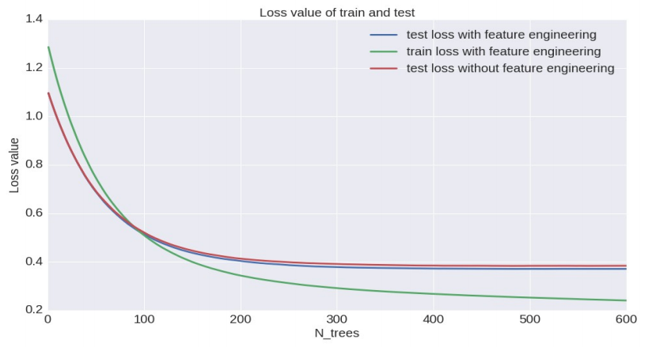

# BlogFeedBackProject

Analysis of BlogFeedback Data Set 

## Project target
Predict the number of comments in a blog after the bastime

## Data Description
The data used here is BlogFeedback Data Set from UCI https://archive.ics.uci.edu/ml/datasets/BlogFeedback 
The data set contatins 1 training data set and 60 test data set.

| Features      |      | 
| ------------- |-----:|
| Rows      　　　| 60021 |
| Columns     　　| 281   | 

## Evaluation
The metric used to evaluate the performace of this model is the log transformed mean squared error.
(1 / *n*)&sum;[ln(1 + *y*)&minus;&fnof;&#770;(*x*)]

## Working Flow

## Feature Engineering
1. Feature Creation - Creating new features by combining different original features, PCA, extracting feature interactions from random forest tree model, etc. 
2. Feature selection - Filtering features by group lasso, feature inportance of random forest model
3. Feature transformation - Transform features by scaling with normalization

## Models
| Model          | training time | Loss |
| :------------- |:-------------:|------:|
| RandomForest   | Moderate      |0.39763|
| KNN            | Fast          |0.63239|
| Lasso          | Fast          |0.49092|
| Neural Network | Very Slow     |0.42592|
| GBM            | Moderate      |0.37127|

## Evaluation
After experiments with feature engineering, we evaluated the performace of Gradient Boosting Tree model

## Ensemble
We further ensemble the gradient boosting tree model by model averaging to improve the performance.

| Model          | Error |
| :------------- |------:|
| Single         |0.37128|
| Ensemble       |0.36985|

## Project Members
Peiran Cao 
Zhoutao Pei 
Boyang Liu

