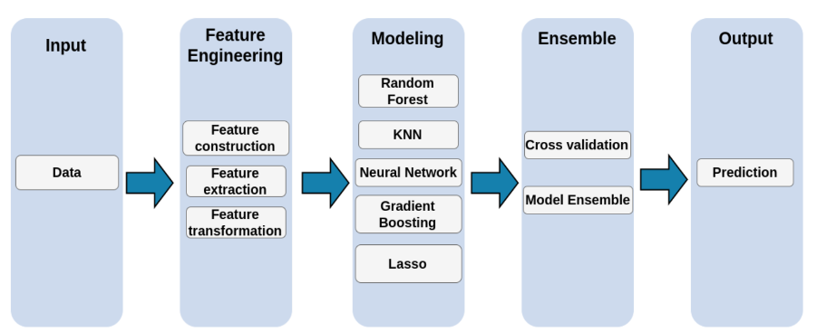

# BlogFeedBackProject

Analysis of BlogFeedback Data Set 

## Project target
Predict the number of comments in a blog after the bastime

## Data Description
The data used here is BlogFeedback Data Set from UCI https://archive.ics.uci.edu/ml/datasets/BlogFeedback 
The data set contatins 1 training data set and 60 test data set.

| Features      |      | 
| ------------- |-----:|
| Rows      　　　| 60021 |
| Columns     　　| 281   | 

## Evaluation
The metric used to evaluate the performace of this model is the log transformed mean squared error.
(1 / *n*)&sum;[ln(1 + *y*)&minus;&fnof;&#770;(*x*)]

## Working Flow

